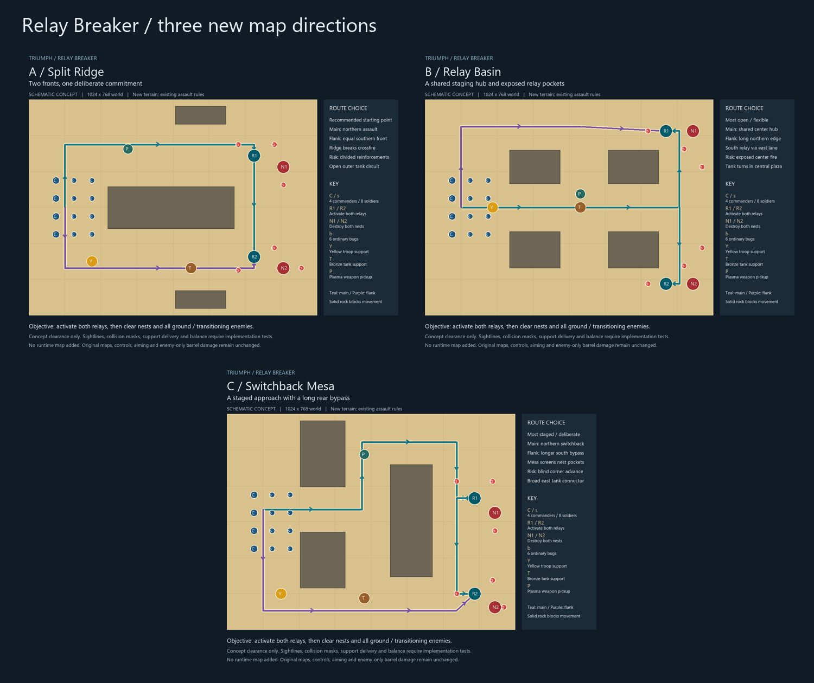

# Relay Breaker — new terrain proposals (TRI-029)

These are authored schematic concepts, not recovered source maps or a playable update. The current Relay Breaker still uses Desert Rocks. Pick one direction and refine it before authorizing implementation.

| Proposal | Why choose it | Route tradeoff / risk | Narrowest designed principal opening |
| --- | --- | --- | --- |
| **A: Split Ridge — recommended** | Readable two-front assault with a central rock spine; either relay can come first. | Northern plasma versus southern troop/tank support; splitting the army exposes reinforcement routes. East connector lets the army regroup. | 220–222 px between the spine and upper/lower rock shelves; west approach 280 px. |
| B: Relay Basin | Broad shared hub and two distinct relay pockets; easiest tank staging. | Central approach branches north/south; northern perimeter bypass avoids hub exposure but delays support. Four rock islands screen the pockets without sealing them. | 170 px between middle islands; 194 px east outer lane. |
| C: Switchback Mesa | Staged advance around a tall mesa with a genuinely different long southern bypass. | Northern switchback brings plasma early; southern route brings support early. Blind corners hide defenders; east connector links objectives. | 148 px southern bypass and 160 px western neck. |

Full-size previews and editable schematics: [A PNG](a-split-ridge.png) / [A SVG](a-split-ridge.svg), [B PNG](b-relay-basin.png) / [B SVG](b-relay-basin.svg), [C PNG](c-switchback-mesa.png) / [C SVG](c-switchback-mesa.svg). [Geometry and actor metadata](proposals.json) uses the original 1024×768 world with top-left origin; actor points are sprite hotspots. Rock rectangles use top-left plus width/height. The grid is 128 px. Routes are suggestions, not walls or compulsory order. Teal connector lines show access to the second relay; purple marks the alternative approach.

Each keeps four commanders, eight soldiers, six ordinary bugs, two nests, two independently keyed relays, yellow troop support, bronze tank support and a plasma weapon pickup (object 54). There is no initial tank. Existing assault completion, difficulty/nest lifecycle, tactical start, asymmetric aiming, German physical-key controls, enemy-only barrel damage, population caps and support rules remain the intended behavior. Both relays may be activated in either order. No waves, timer, doors, additional barrels or new unit types are proposed.

## Feasibility and implementation seam

All terrain is open outdoor ground except the solid rock islands. At concept level all 25 actor/object placements connect to deployment on a 16 px cardinal grid with a conservative 32 px square margin. Every route segment reserves a 64 px corridor; every nest has a clear reachable cardinal firing position 128 px away, within current soldier detection range. Actual corridor openings are wider than that test minimum (table above). These checks demonstrate geometric access only, not tank sprite fit, pathfinding turns, firing accuracy or balance. Schematics intentionally omit decorative rock edges; any visual/collision variation must preserve the approved clearance.

The selected map needs a **new custom-owned terrain image and collision mask** plus explicit terrain metadata. It must not replace `assets/maps/7.png` or other recovered assets. Existing terminal/nest/unit/support/weapon sprites can be reused; no new sprite animation is needed. Sand and rock styling can follow the existing palette, but any source-derived art must retain provenance and distribution restrictions. Asset authoring is smallest for A (three rock masses), moderate for B (four islands), moderate for C (three masses with more turns).

Current `game.js` `originalBegin` loads art/mask and source support/rules together; `loadCustomMission` starts from the original fixture and replaces scenario actors. A bounded follow-up must separate **custom terrain override** from that source rule/support template, preserving original indices and the nine original maps. The selected proposal supplies placement data to `src/custom-missions.js`; no runtime code is changed here. Source Desert Rocks support eligibility may remain the template, but carrier entry/drop paths must be validated against the new mask and may require custom-owned delivery geometry. Indoor assumptions or new support rules are unnecessary.

Before acceptance as playable: test both relay orders, real interaction positions and all enemy firing approaches; tank delivery/turning, rally routes and formations; restart/difficulty and original-map isolation; then record a live Normal playthrough with casualties, support use, completion time and nest births. No runtime browser/audio/playability or balanced gameplay is claimed by this proposal review.

Local authoring: run `python docs/design/relay-breaker-maps/render.py` using a local Pillow installation to regenerate the paired SVG/PNG assets and contact sheet; this is not a runtime dependency. Run `python docs/design/relay-breaker-maps/verify.py` for the standalone conceptual checks. SVGs are directly editable; `render.py` is the authored geometry source for regeneration, and regeneration overwrites manual SVG edits.

**Decision requested:** A, B or C; preferred sand/rock visual style; any desired change to route openness, support placement or relay positions. Recommendation: refine A first for a clear new assault map with low terrain-authoring complexity.

