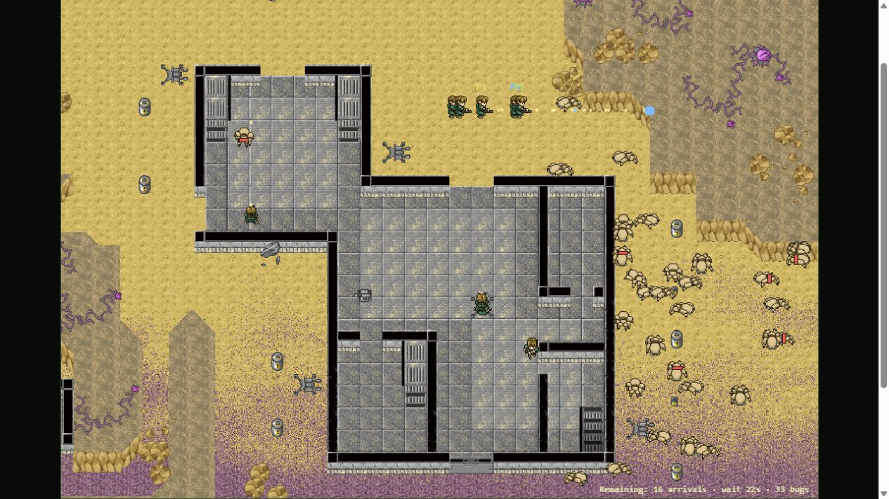
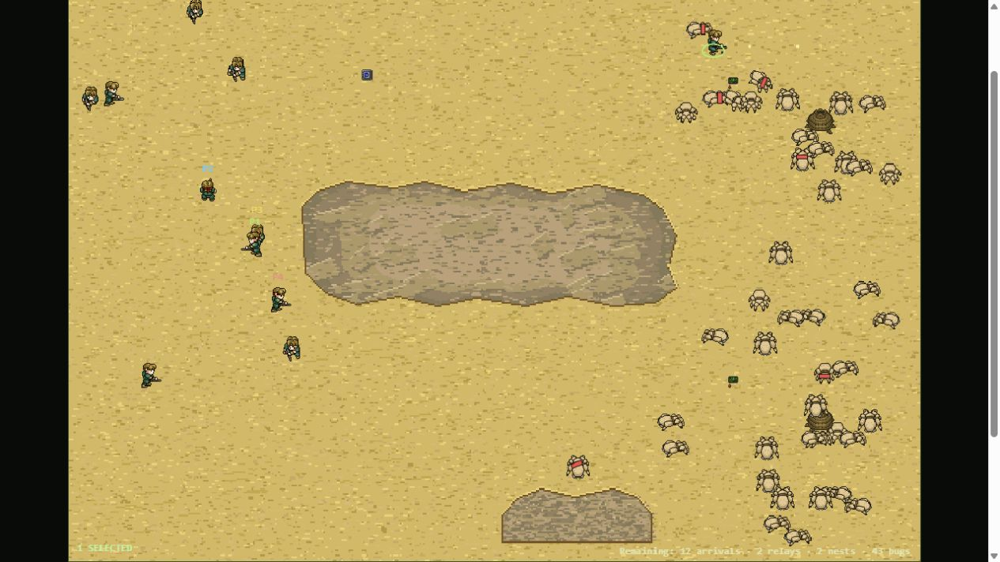

# 2026-10-05 custom challenge browser smoke

- Checkout: triumph-custom-mission-challenge; working TRI-034 revision based on66ab2e8.
- Browser: Codex IAB Chromium; exact version unavailable. Local loopback8787.
- Difficulty: Hard. No Windows MIDI sample-bank verification; audio not evaluated.
- Purpose: rendering, deployment, sustained actual runtime pressure; not full balance acceptance.

Hard Last Convoy was selected via Controls difficulty and Mission UI, deployed, then exited tactical mode. No player combat/order input was issued; default AI ran. The first saved combat view shows35-ish on-field pressure: HUD explicitly34 bugs,16 arrivals pending,29s remaining (~91s). Later live view showed28 remaining bugs after all scheduled arrivals, with survivors scattered. Hard initial reduced army/no tank and80-arrival progress rendered correctly. No victory or defeat was observed before switching mission.

Hard Relay deployed in tactical mode, rendered Split Ridge unchanged, with24 arrivals,2 relays and2 nests in HUD. Six starting soldiers and troop/plasma support, no tank, visible. Drag-select northern troops and a right-click attack-move toward the northern relay were issued before unpausing. Follow-up observations recorded below. No manual commander shots or grenades.

Normal/easier full human playthrough, both Very Hard human playthroughs, tactical victory on both maps, audio and skilled-player challenge calibration: not run. Automated VM combat/geometry results are recorded separately in design/custom-challenge.md and its JSON log; these are not browser pass claims. Existing historical screenshots remain historical.

Follow-up Relay view: one selected soldier reached the northern approach; screenshot HUD showed12 arrivals pending,2 relays,2 nests and43 bugs. Bugs crowded both nest pockets while combat occurred along northern lane. Drag selection produced one selected soldier, so this was a limited single-soldier attack-move smoke, not a complete squad tactic evaluation. No relay activation/nest kill/victory observed. Live screenshot supports actual pressure/route movement only.

