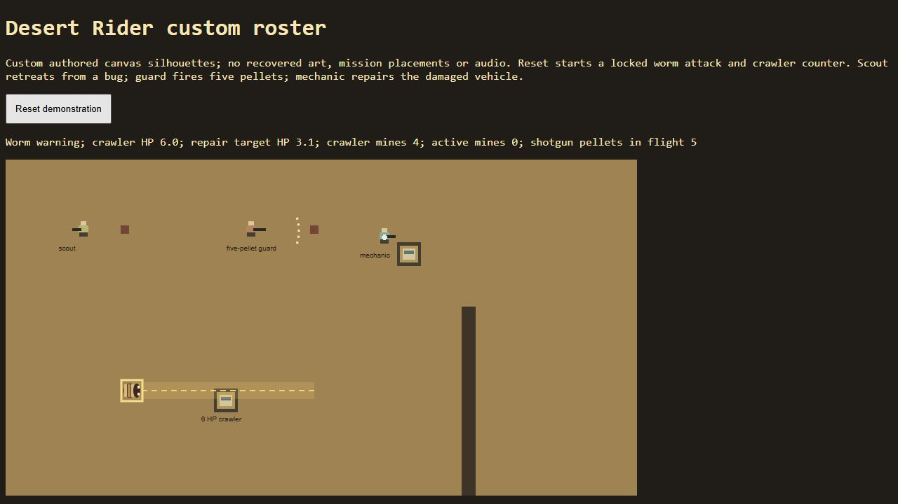

# TRI-040 isolated browser evidence

- Date: 2026-10-05; branch `feature/desert-rider-roster`, final working source before commit.
- Browser: Codex in-app browser (Chromium backend; exact version unavailable through returned API).
- Fixture: `node tools/rider-preview.cjs`, loopback `http://127.0.0.1:2140/`.
- Difficulty: not applicable; fixed module tuning. MIDI/sample-bank state: not loaded; fixture has no audio.
- Computer Use skill applied for browser inspection. No original game or full mission browser run.

Live page initially reported worm warning, crawler HP 6, four mine rounds and five pellets in flight. Reset was clicked and the live canvas displayed separate scout/guard/mechanic/crawler silhouettes, worm lane and pellet fan. Subsequent live observations showed the crawler counter consuming ammunition and returning to its route. Repeated attacks eventually killed the crawler in the continuous fixture, confirming that the counter grants no permanent immunity. The mechanic demonstration repair target progressed from 3 HP toward its 6 HP cap.

| Scenario | Result | Evidence / limit |
| --- | --- | --- |
| Custom silhouettes, mine marks and five-pellet fan render | Passed | Live canvas and screenshot |
| Reset control restarts locked warning | Passed | Fresh AX warning, 6 HP, four mine rounds |
| Live crawler counter and later vulnerability | Passed | Warning/charge/recovery observations, mine ammo decreased; sustained fixture reached 0 HP |
| Mechanic repair and scout retreat in fixture | Passed | Live target HP increased; scout silhouette moved away from nearby bug |
| Shared infantry controls, full mission rendering/audio/playability | Not run in browser | New infantry control paths covered separately by disposable VM fixtures; roster has no mission placement yet |
| Human challenge / new map acceptance | Not run | Map choice and TRI-036 activation remain pending |

Exact damage, cooldown, clearance, phase timing, ammo/caps, cardinal controls and full-body navigation are simulation assertions, not inferred from this screenshot.
