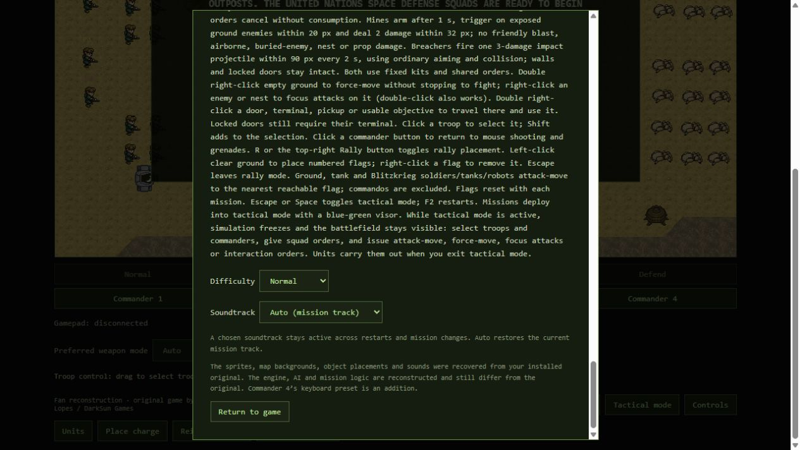

# TRI-067 soundtrack browser record

- Build: feature/royalty-free-soundtrack-expansion, working candidate after `aa95da1`; exact review commit is in the [session handoff](../journal/2026-10-09-002-royalty-free-soundtrack-expansion.md).
- Date: 2026-10-09 (Europe/Berlin).
- Browser: Codex In-app Browser (Chromium engine version not exposed); hidden worker tab at `http://127.0.0.1:2107/`, screenshot viewport 1265×712.
- Difficulty: Normal. MIDI bank: absent; oscillator fallback.
- Tester: TRI-067 recovery worker using Browser UI tools; no human listening channel.

| Scenario | Result | Actual evidence |
| --- | --- | --- |
| Controls selector/default/layout | pass | Opened Controls on Desert Canyon. Auto was selected. Fourteen original choices and eight theme choices present. Final screenshot shows readable selector and override explanation. |
| Eight theme selections | pass (UI) | Selected Snow, Title/Briefing, Maritime, Capital, Desert, Jungle, Volcanic and Undercity. Native select displayed each exact corresponding value/label. No captured warning/error after changes. |
| Custom transition/manual override | pass (UI) | Left Controls on Undercity; selected Whiteout Signal and clicked Start mission. Tactical-mode button became Exit tactical mode. Reopened Controls: Undercity retained. |
| Return to Auto | pass (UI) | Selected Auto after transition; native select displayed Auto (mission track). Internal assignment/scheduling restoration is VM evidence only. |
| Original numeric-string choice/restart | pass (UI) | Selected Original track 14 (value 13), closed Controls, clicked Restart mission, reopened Controls: Original track 14 retained. |
| Page reload default | pass (UI) | Reloaded final UI and reopened Controls: Auto (mission track), value auto. |
| Browser error capture | pass (limited) | Captured warn/error logs returned an empty list after all tested selections/transitions. This is not proof that sound reached an output device. |
| Audible playback, theme quality/loop seams | not run | Browser tooling exposes no listening/audio capture channel. Scheduler/voice cancellation/gesture behavior is verified separately in mocked WebAudio tests. |
| Offline browser with network disabled | not run | No network-disable control used. Local source has no added network API; VM/composition checks do not provide network APIs. No runtime remote track URLs introduced. |
| MIDI sample-bank rendering/timbre | not run | Ignored local Windows bank absent. No bank generated or uploaded. |
| Narrow responsive layout / complete gameplay checklist | not run | This bounded check covers selector UI at recorded viewport; unrelated PLAYTEST scenarios unchanged. |

## Evidence

## Acceptance

Selector UI acceptance passed at recorded viewport. Audible quality, loop seams, actual output devices and optional bank timbres await human listening. VM scheduling is not audible verification; original-game comparison/research was not performed. No publication occurred.
